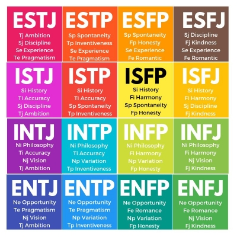
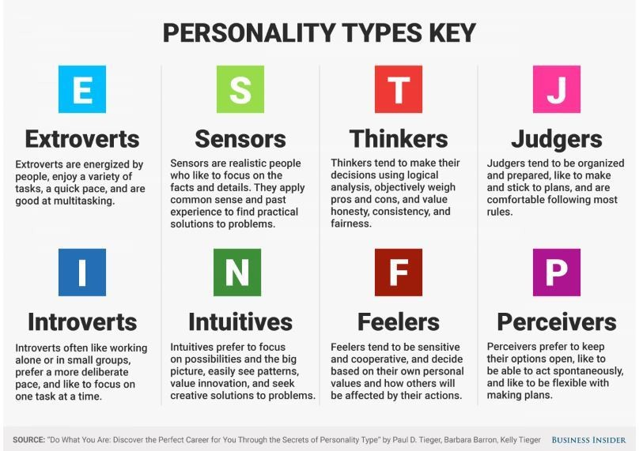

# MBTI-Classification

The Myers Briggs Type Indicator (MBTI) consists of 16 Classes of Each Personality Type. 

1. INFP
2. INFJ
3. INTP
4. INTJ
5. ISFP
6. ISFJ
7. ISTP
8. ISTJ
9. ENFP
10. ENFJ
11. ENTP
12. ENTJ
13. ESFP
14. ESFJ
15. ESTP
16. ESTJ

Each Personality type is diverged within Four Axes :

1. Introversion (I) – Extroversion (E) 
2. Intuition (N) – Sensing (S) 
3. Thinking (T) – Feeling (F) 
4. Judging (J) – Perceiving (P) 

The Dataset consists of over 8600 rows of data. 
Each row consists of two columns :
1. a string of 50 latest posts of a person, separated by "|||" characters.
2. the MBTI Personality Type of the person. 

## Colab Experiments 
https://colab.research.google.com/drive/1s5CgEJFQuskF4HL4x4DMV8Ik4xzqJ-ey?usp=sharing

## End to End Machine Learning Deployment with Scikit Learn and Flask REST API